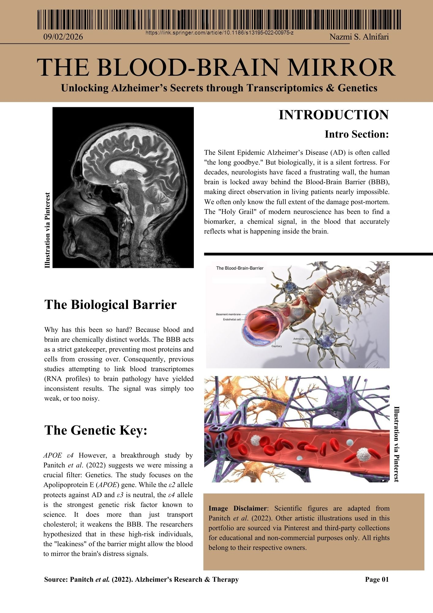
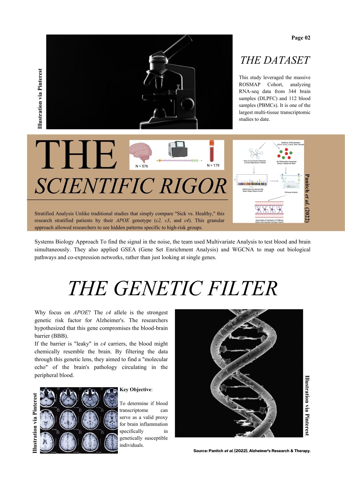
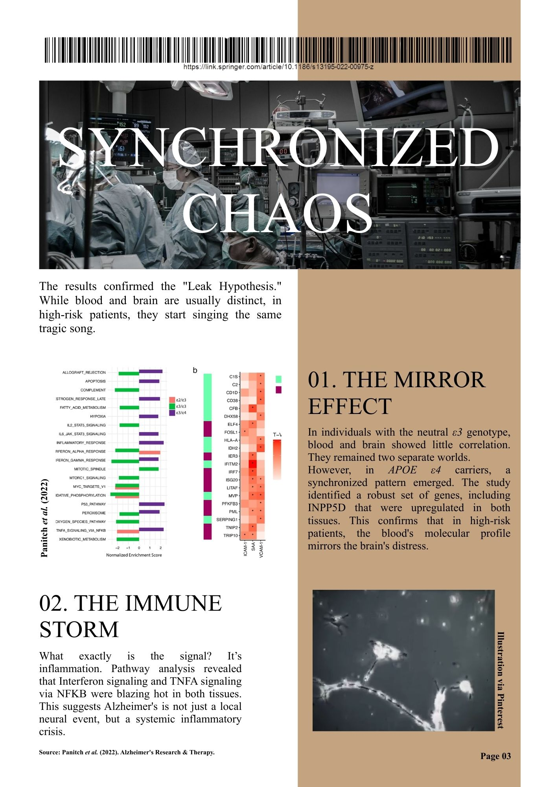
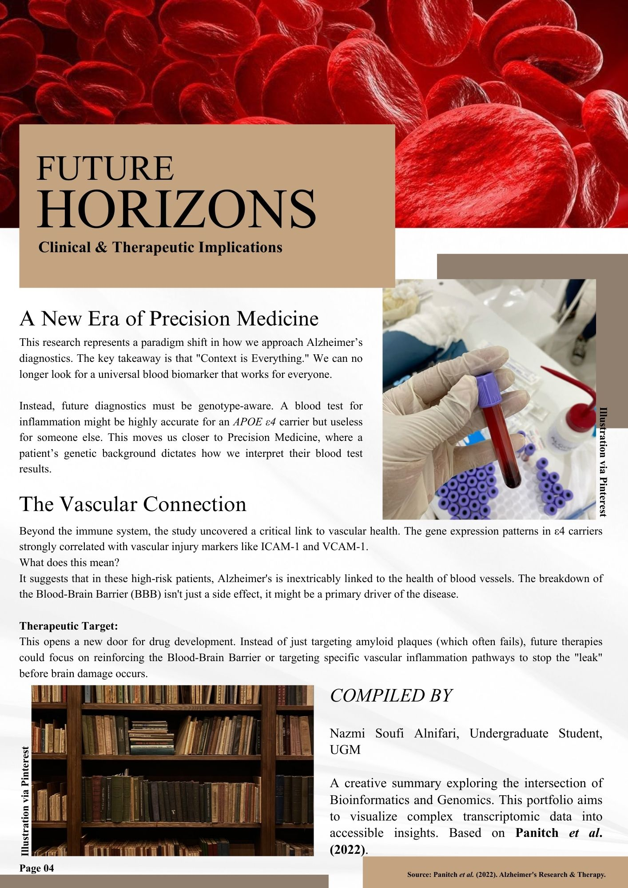

# 🧬 The Blood-Brain Mirror: Transcriptomics Analysis

> **Topic:** Alzheimer's Disease, APOE Genotype, & Blood-Brain Barrier
> **Based on:** Panitch et al. (2022)

## 📌 Overview
This project is a visual summary of a transcriptomic study exploring how blood can serve as a proxy for brain inflammation in Alzheimer's patients, specifically those carrying the *APOE ε4* risk allele.

The goal is to simplify complex multi-tissue analysis (Brain vs. Blood) into an accessible, magazine-style format.

## 📖 The Visual Summary

### Page 1: Introduction & Hypothesis

### Page 2: Methodology & Data

### Page 3: Key Results & Pathways

### Page 4: Conclusions & Future Horizons

---

## 📥 Download Full PDF
Want to read the high-quality version?
[**Download the PDF here**](transcriptomics-alzheimer-review.pdf)

---
*Created by [Nazmi Soufi Alnifari] as part of Bioinformatics Learning Journey.*
